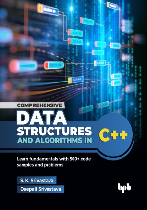

# Comprehensive Data Structures and Algorithms in C++

Learn fundamentals with 500+ code samples and problems.

This is the repository for [Comprehensive Data Structures and Algorithms in C++
](https://bpbonline.com/products/comprehensive-data-structures-and-algorithms-in-c-1?variant=44627841319112),published by BPB Publications.

## About the Book
Data structures and algorithms is an essential subject in computer science studies. It proves to be a great tool in the hands of any software engineer, and also plays a significant role in software design and development. It has become a must-have skill now for many competitions and job interviews in the software industry.

The concepts are explained in a step-wise manner and illustrated with numerous figures, text, examples, and immediate code samples, which help in a better understanding of data structures and algorithms with their implementation. The book has more than 500 illustrations, code samples, and problems, along with solutions for exercises. 

This book provides a comprehensive study of data structures and algorithms, starting with an introduction to time and space complexity analysis using asymptotic notation. It explores arrays and matrices, then progresses to linked lists, stacks (LIFO), and queues (FIFO), emphasizing their respective operations and applications. A detailed chapter on recursion, including base cases and recursive calls, lays the groundwork for understanding binary trees and binary search trees, and graph algorithms such as DFS and BFS. Finally, the book covers storage management, addressing memory allocation, release and garbage collection. 

This book provides practical C++ implementations and problem-solving exercises to foster a solid understanding of these core computer science concepts. After completion of this book, students will have a good understanding of data structures and algorithms concepts and implementation. Software engineers will be able to provide more effective solutions with the use of appropriate data structures and efficient algorithms.

## What You Will Learn
• Fundamentals of data structures and algorithms.

• Algorithms analysis.

• A variety of data structures and algorithms useful for software design and development.

• How to efficiently use different data structures and algorithms.

• When and where to use appropriate data structures and algorithms.

• Data structures and algorithms concepts with implementation.

• Approach to solve problems using the right data structures and algorithms.
